# Authentication Testing Plan Execution

### Authentication Endpoints Mapping

Authentication endpoints were previously identified during the reconnaissance and mapping phase and are documented in Figure [2]. The same API map is included below for reference.

**Note:** Authentication-related endpoints are grouped under the `/auth` path.

<p align="center">
  
</p>
<p align="center"><em>Figure 1: crAPI API map.</em></p>

---

### Login Validates Credentials Properly

Three different authentication scenarios were tested:

* Valid email / invalid password
* Invalid email / valid password
* Valid email / valid password
**📝 Excpected result:** Only user with valid credentials should login successfully !

The behavior of both the client-side application and the server-side authentication endpoint was analyzed. Burp Suite Repeater was used to interact directly with the backend authentication endpoint and inspect the corresponding HTTP responses.

* The first case shows that authentication is rejected when a valid email address is submitted with an invalid password. The client-side application displays the failed login attempt, while the server rejects the submitted credentials:

<p align="center">
  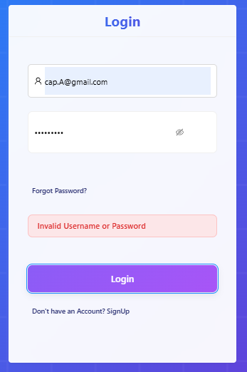
</p>
<p align="center"><em>Figure 2: crAPI invalid login - case 1 (client-side).</em></p>

<p align="center">
  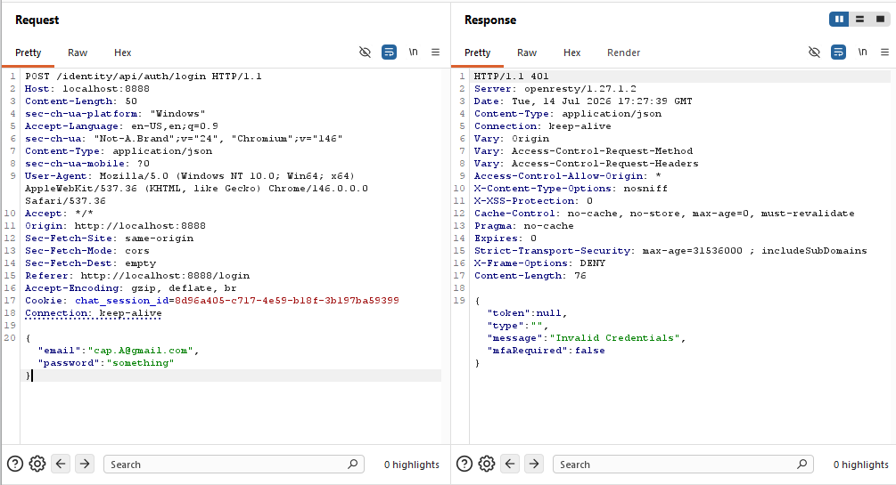
</p>
<p align="center"><em>Figure 3: crAPI invalid login - case 1 (server-side).</em></p>

* The second case produces the expected outcome when an invalid email address is submitted with a valid password. Authentication is rejected by the server and the login attempt fails on the client side:

<p align="center">
  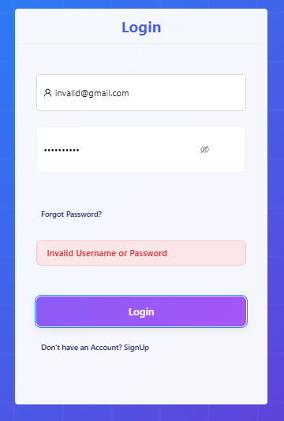
</p>
<p align="center"><em>Figure 3: crAPI invalid login - case 1 (server-side).</em></p>

<p align="center">
  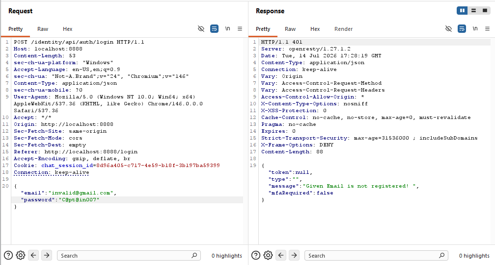
</p>
<p align="center"><em>Figure 4: crAPI invalid login - case 2 (client-side).</em></p>

* In the final case, valid login credentials were submitted. The login process was successfully completed and the user was granted access to the application. The screen recording below demonstrates the successful client-side authentication flow:

[▶ View crAPI valid login - case 3 (client-side)](../../artifacts/screen_recordings/valid_creds_trim.mp4)

The corresponding server-side response confirms that the authentication request was successfully processed:

<p align="center">
  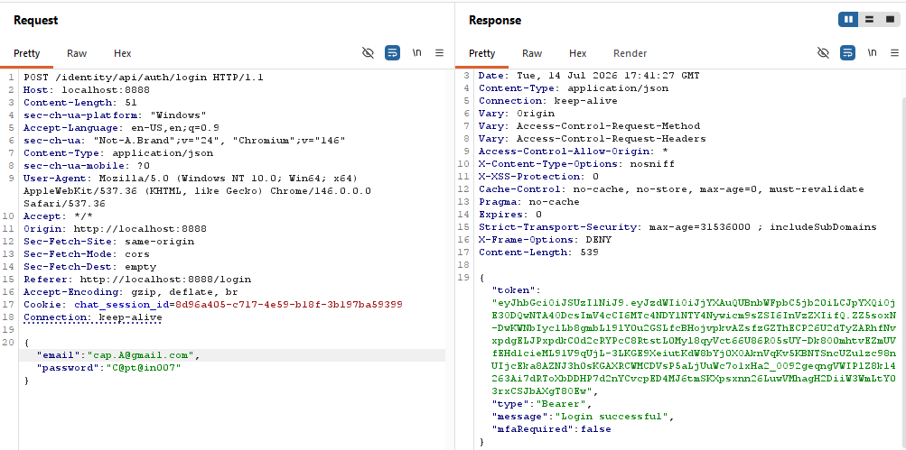
</p>
<p align="center"><em>Figure 5: crAPI valid login - case 3 (server-side).</em></p>

Based on the performed tests, the login mechanism correctly accepts valid credentials and rejects the tested invalid credential combinations.

🟢 **Result → Passed: Login Validates Credentials Properly !**

---

### SQL Injection Login Bypass Is Tested

The login form implements client-side email format validation. SQL injection payloads entered directly into the email field are rejected by the frontend because they do not match the expected email format.

**📝 Excpected result:** SQL Injection payload should not be effective !

<p align="center">
  
</p>
<p align="center"><em>Figure 6: crAPI email validation with SQL payload.</em></p>

A valid email address is accepted by the client-side validation:

<p align="center">
  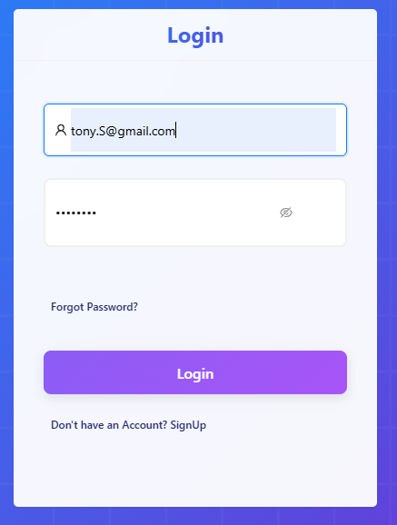
</p>
<p align="center"><em>Figure 7: crAPI email validation with valid email.</em></p>

To bypass the client-side validation and test the authentication endpoint directly, a valid login request was intercepted using Burp Suite and forwarded to Repeater.

<p align="center">
  
</p>
<p align="center"><em>Figure 8: crAPI login request interception.</em></p>

The original email value was then replaced with an SQL injection payload before sending the request directly to the API.

<p align="center">
  
</p>
<p align="center"><em>Figure 9: crAPI SQL injection payload in Repeater.</em></p>

🟢 **Result → Passed: SQL injection login bypass was unsuccessful.**

The authentication endpoint returned `HTTP 401 Unauthorized`, and no authentication token was issued.

---

### Error Messages Do Not Reveal Valid Users

Two authentication scenarios were tested:

- Valid email / Invalid password
- Invalid email / Valid password

The objective was to determine whether authentication error messages disclose the existence of registered users.

<p align="center">
  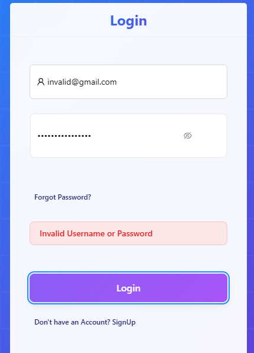
</p>
<p align="center"><em>Figure 10: crAPI failed login case 1.</em></p>

<p align="center">
  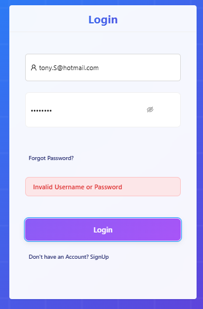
</p>
<p align="center"><em>Figure 11: crAPI failed login case 2.</em></p>

🟢 **Result → Passed: Error messages do not reveal valid users client-side.**

The login interface displays a generic authentication error message and does not distinguish between an invalid email address and an invalid password.

**However:**

The underlying authentication API responses were inspected using Burp Suite Repeater.

<p align="center">
  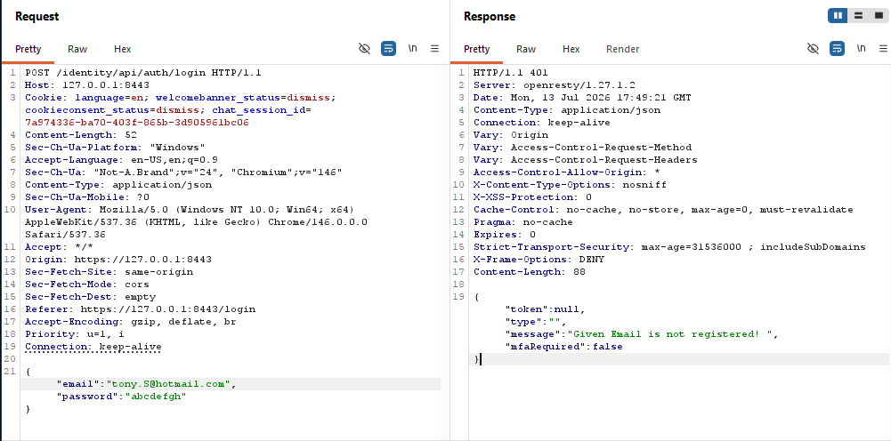
</p>
<p align="center"><em>Figure 12: crAPI failed login - Burp Suite perspective - invalid email and password.</em></p>

<p align="center">
  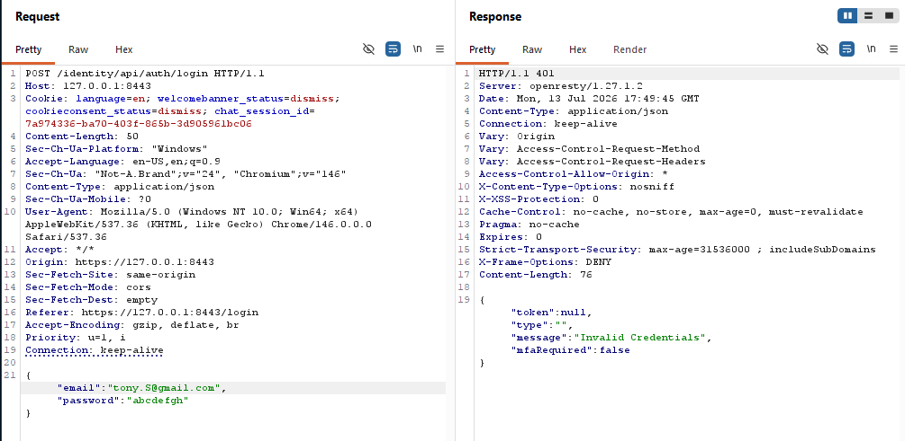
</p>
<p align="center"><em>Figure 13: crAPI failed login - Burp Suite perspective - valid email and invalid password.</em></p>

The following behavior was observed:

- Invalid email / Invalid password → `Given Email is not registered!` ❌
- Invalid email / Valid password → `Given Email is not registered!` ❌
- Valid email / Invalid password → `Invalid Credentials` ✅

🔴 **Result → Failed: Registered users can be enumerated through authentication API error messages.**

Although the frontend displays a generic error message, the authentication API returns different responses depending on whether the supplied email address is registered.

An attacker can therefore distinguish registered email addresses from unregistered email addresses by analyzing the API response.
---

### Password Policy Is Enforced

The crAPI registration interface defines the following password requirements:

- At least one digit
- At least one lowercase letter
- At least one uppercase letter
- At least one special character
- Between 8 and 16 characters
**📝 Excpected result :** The password should not be accepted if it doesn't follow the SUT policy !

<p align="center">
  
</p>
<p align="center"><em>Figure 14: crAPI password policy 1.</em></p>

<p align="center">
  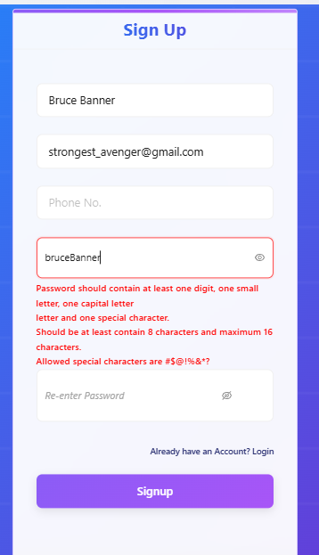
</p>
<p align="center"><em>Figure 15: crAPI password policy 2.</em></p>

<p align="center">
  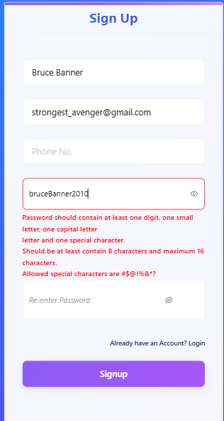
</p>
<p align="center"><em>Figure 16: crAPI password policy 3.</em></p>

<p align="center">
  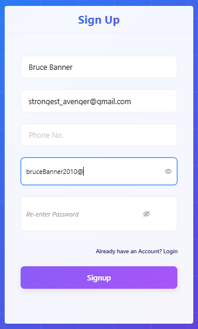
</p>
<p align="center"><em>Figure 17: crAPI password policy 4.</em></p>

🟢 **Result → Passed: Password policy is enforced client-side.**

**However:**

A valid signup request containing the strong password `We@@k007` was intercepted using Burp Suite and forwarded to Repeater.

The password value was then replaced with the weaker password `abcdefg`, which does not meet the password complexity requirements defined by the registration interface.

The modified request was sent directly to the registration API.

<p align="center">
  
</p>
<p align="center"><em>Figure 18: crAPI password policy bypass.</em></p>

🔴 **Result → Failed: Password policy is not enforced server-side.**

The registration API accepted the weak password despite it violating the password complexity requirements enforced by the frontend.

This demonstrates that password complexity validation is implemented only on the client side and can be bypassed by directly modifying the API request.

### Brute Force Protection Exists

**tool : ffuf v2.1.0-dev**

In this test, a brute-force attack will be conducted against the login endpoint as an attempt to guess a valid user's password.
**📝 Excpected result :** At least one of the following brute-force counter-measures should be enforced :
- Account lockdown after unsuccessful login attempts.
- Account cool down after unsuccessful login attempts.
- Increasing response time after each unsuccessful attempt.
- Use of status code other than 401 (e.g., **429 : Too many requests** - **403 : Forbidden request**)
 
The following command was executed using ffuf :
```
ffuf -w Desktop/<DICTIONARY_FILE_PATH> \
-u http://<TARGET_IP>:<PORT>/identity/api/auth/login \ 
-X POST \
-H "Content-Type: application/json" \
-d '{"email":"<VALID_EMAIL>", "password":"FUZZ"}' \
-mc all \
-v
```

<p align="center">
  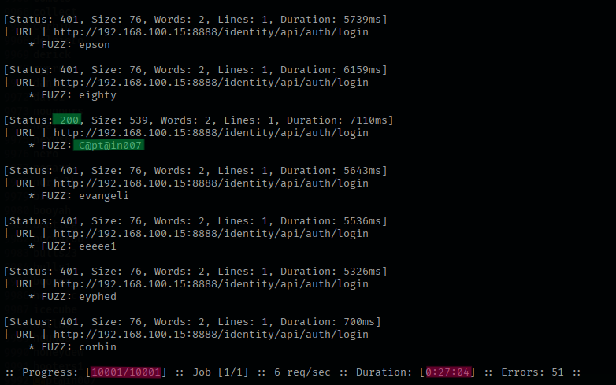
</p>
<p align="center"><em>Figure 19: crAPI login brute force attack.</em></p>

As shown in the figure above, the attack was running for **27 minutes and 04 seconds** and tried **10 001** possible passwords. Eventually, one of the supplied passwords matched the user's credentials, and the server returned an **HTTP 200 OK** response.

🔴 **Result -> Failed: None of the brute-force counter-measures mentioned above were implemented !**


### OTP is Rate-Limited

**tool : ffuf v2.1.0-dev**

This test evaluates whether the OTP verification endpoint implements rate limiting to prevent brute-force attacks against one-time passwords by following the procedure below:
- Login as a valid user.
- Initiate the process to change this user's phone number.
- Input the new phone number.
- Use any random OTP value then intercept the request with burp suite.
- Copy the payload.
- Start the brute-force attack.
**📝 Expected result:** The application should implement one or more mechanisms to limit repeated OTP verification attempts, such as:
- Rate limiting after multiple failed attempts.
- Temporary timeout after repeated failures.
- Increasing delays between consecutive attempts.
- Blocking requests with responses such as **HTTP 429 Too Many Requests** or **HTTP 403 Forbidden** once the allowed threshold is exceeded.

<p align="center">
  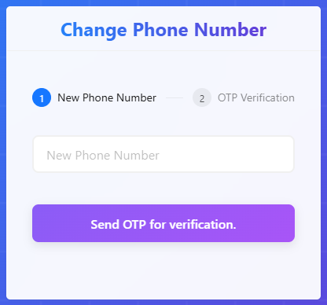
</p>
<p align="center"><em>Figure 20: crAPI change phone number.</em></p>

After submitting the new phone number, an OTP is received via crAPI local mail service:
<p align="center">
  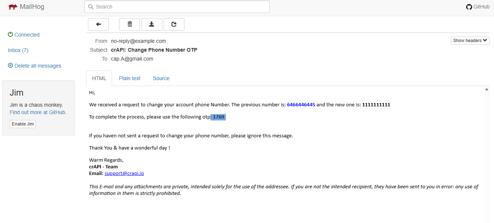
</p>
<p align="center"><em>Figure 21: crAPI received OTP via mail.</em></p>

After sending a random OTP, we intercept the request using burp suite repeater:
<p align="center">
  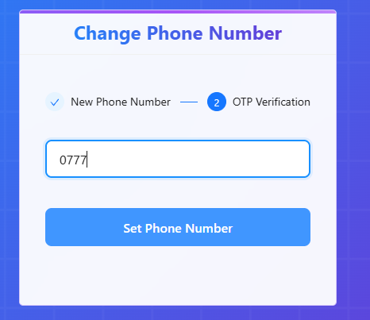
</p>
<p align="center"><em>Figure 22: crAPI random OTP submission.</em></p>

<p align="center">
  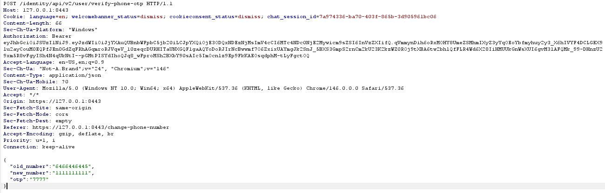
</p>
<p align="center"><em>Figure 23: crAPI new phone number request intercepted.</em></p>

The following command was performed against the OTP verification endpoint:

```
ffuf -w Desktop/<DICTIONARY_FILE_PATH> \
-u http://<TARGET_IP>:<PORT>/identity/api/v2/user/verify-phone-otp \ 
-X POST \
-H "Content-Type: application/json" \
-d '{"old_number":"6464646464","new_number":"6466446445","otp":"FUZZ"}' \
-mc 200 \
-v
```

💡 **Tip A:** A good approach would be to initiate the phone number changing process e2e using a valid user in order to understand the OTP structure (in this case 4 digists), then create a dictionary text file containing all possible combinations.
💡 **Tip B:** To increase the chances of finding the correct OTP as fast as possible, shuffling the dictionary file can be of value.

<p align="center">
  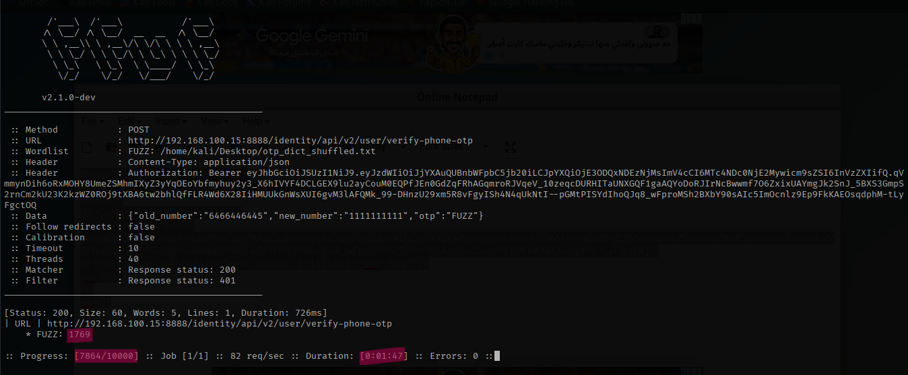
</p>
<p align="center"><em>Figure 24: crAPI OTP brute force.</em></p>

As shown in the figure above, **7864** OTP was tried in **1 minutes and 47 seconds**, one match found and returned **200 HTTP OK**. By returning to the OTP received from the mail service we can confirm that it is a positive match !

🔴 **Result → Failed: None of the OTP brute-force limitation mechanisms above were implemented**

### Logout invalidates session/token

This test verifies whether logging out invalidates the user's JWT and prevents it from being used after the session has ended.

The following procedure was performed:

- Log in as a valid user.
- Intercept the JWT verification request and send it to Burp Suite Repeater.
- Verify that the JWT is accepted by the server.
- Log out to terminate the user's session.
- Replay the same JWT verification request.

**📝 Expected result:** The JWT should no longer be accepted after the user logs out, and any subsequent requests using the same token should be rejected.

After logging in, the user receives a JWT:

<p align="center">
  
</p>
<p align="center"><em>Figure 25: crAPI received JWT.</em></p>

The token is accepted by the server:

<p align="center">
  
</p>
<p align="center"><em>Figure 26: crAPI valid JWT verification.</em></p>

The user then logs out, terminating the session:

<p align="center">
  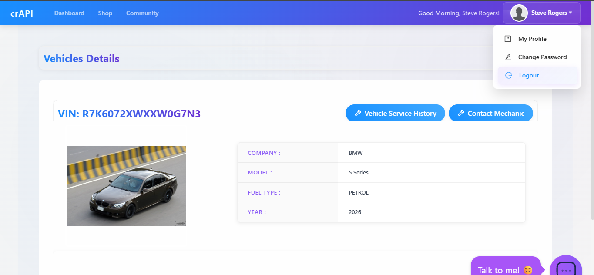
</p>
<p align="center"><em>Figure 27: crAPI logout.</em></p>

The same JWT was replayed after logout and was still accepted by the server:

<p align="center">
  
</p>
<p align="center"><em>Figure 28: crAPI JWT still valid after logout.</em></p>

🔴 **Result → Failed: Logging out does not invalidate the issued JWT. The token remains valid and can continue to authenticate requests until it expires.**

### Sensitive data is not exposed in tokens

JWT payload claims should not contain sensitive information because JWTs are encoded, not encrypted. Anyone in possession of a token can easily decode its payload without knowing the signing key.

To verify that no sensitive information was exposed, an intercepted JWT was decoded using jwt.io, and its payload was inspected.

📝 **Expected result:** The JWT should not expose sensitive information such as passwords, secrets, or other confidential user data.

<p align="center">
  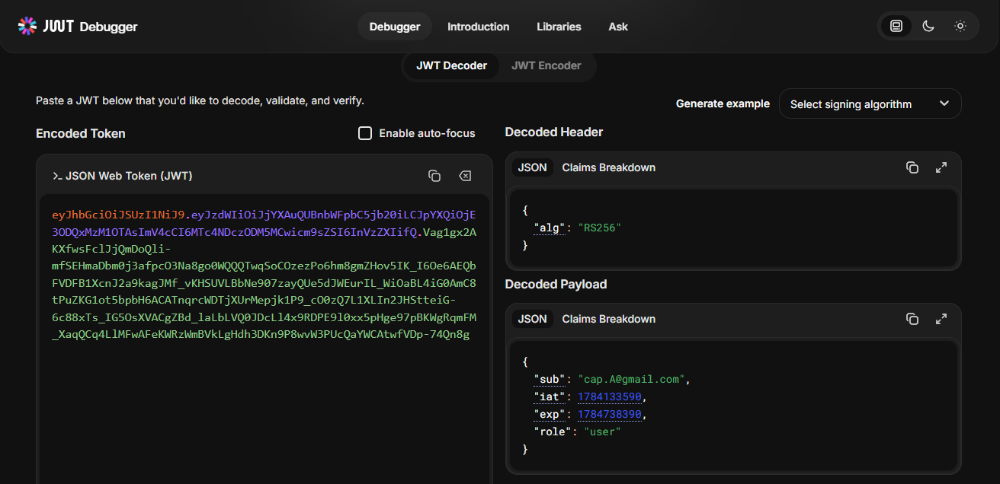
</p>
<p align="center"><em>Figure 29: crAPI decoded JWT.</em></p>

🟢 **Result → Passed: No sensitive data was exposed.**

The decoded token only contained standard claims (sub, role, iat, and exp). No passwords, API keys, session secrets, or other confidential information were present.

⚠️ **Observation:**
The sub (subject) claim contains the user's email address. Although this is a common implementation and does not constitute a security vulnerability by itself, using an internal user identifier instead of an email address is generally considered better practice, as it exposes less personally identifiable information if the token is disclosed.