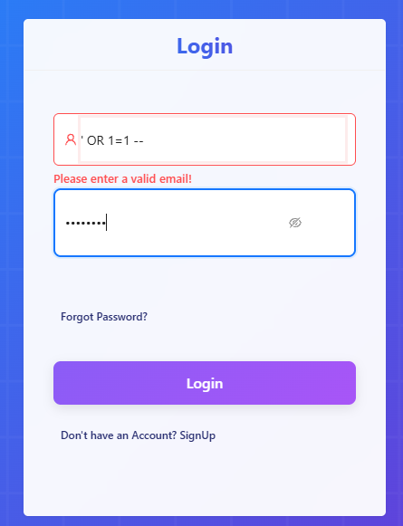
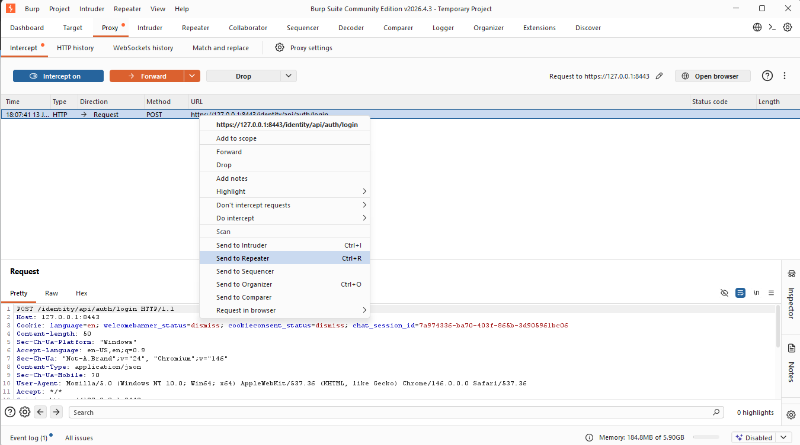
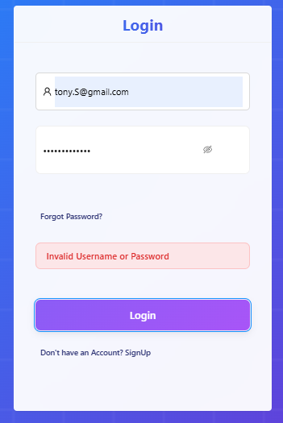
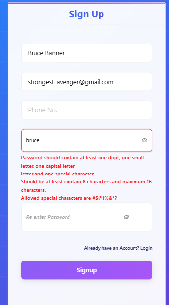
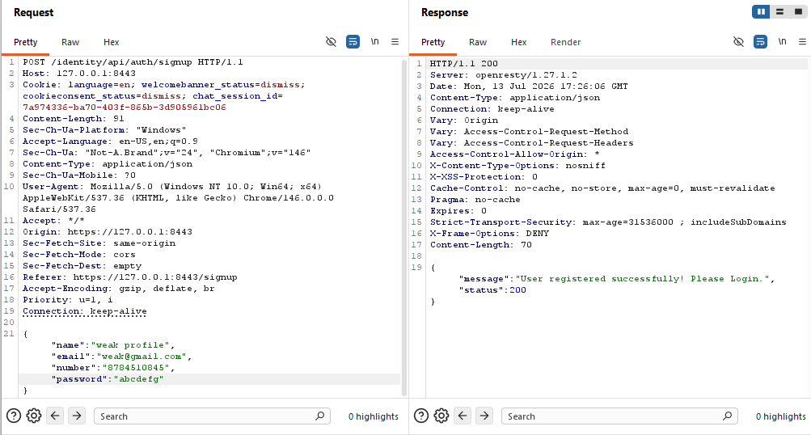

# Authentication Testing Plan Execution

### Authentication Endpoints Mapping

Authentication endpoints were previously identified during the reconnaissance and mapping phase and are documented in Figure [2]. The same API map is included below for reference.

**Note:** Authentication-related endpoints are grouped under the `/auth` path.

---

### Login Validates Credentials Properly

---

### SQL Injection Login Bypass Is Tested

The login form implements client-side email format validation. SQL injection payloads entered directly into the email field are rejected by the frontend because they do not match the expected email format.

A valid email address is accepted by the client-side validation:

To bypass the client-side validation and test the authentication endpoint directly, a valid login request was intercepted using Burp Suite and forwarded to Repeater.

The original email value was then replaced with an SQL injection payload before sending the request directly to the API.

🟢 **Result → SQL injection login bypass was unsuccessful.**

The authentication endpoint returned `HTTP 401 Unauthorized`, and no authentication token was issued.

---

### Error Messages Do Not Reveal Valid Users

### Error Messages Do Not Reveal Valid Users

Two authentication scenarios were tested:

- Valid email / Invalid password
- Invalid email / Valid password

The objective was to determine whether authentication error messages disclose the existence of registered users.

🟢 **Result → Error messages do not reveal valid users client-side.**

The login interface displays a generic authentication error message and does not distinguish between an invalid email address and an invalid password.

**However:**

The underlying authentication API responses were inspected using Burp Suite Repeater.

The following behavior was observed:

- Invalid email / Invalid password → `Given Email is not registered!` ❌
- Invalid email / Valid password → `Given Email is not registered!` ❌
- Valid email / Invalid password → `Invalid Credentials` ✅

🔴 **Result → Registered users can be enumerated through authentication API error messages.**

Although the frontend displays a generic error message, the authentication API returns different responses depending on whether the supplied email address is registered.

An attacker can therefore distinguish registered email addresses from unregistered email addresses by analyzing the API response.
---

### Password Policy Is Enforced

The crAPI registration interface defines the following password requirements:

- At least one digit
- At least one lowercase letter
- At least one uppercase letter
- At least one special character
- Between 8 and 16 characters

🟢 **Result → Password policy is enforced client-side.**

**However:**

A valid signup request containing the strong password `We@@k007` was intercepted using Burp Suite and forwarded to Repeater.

The password value was then replaced with the weaker password `abcdefg`, which does not meet the password complexity requirements defined by the registration interface.

The modified request was sent directly to the registration API.

🔴 **Result → Password policy is not enforced server-side.**

The registration API accepted the weak password despite it violating the password complexity requirements enforced by the frontend.

This demonstrates that password complexity validation is implemented only on the client side and can be bypassed by directly modifying the API request.

### Logout invalidates session/token => Logout Does Not Invalidate Session Token

