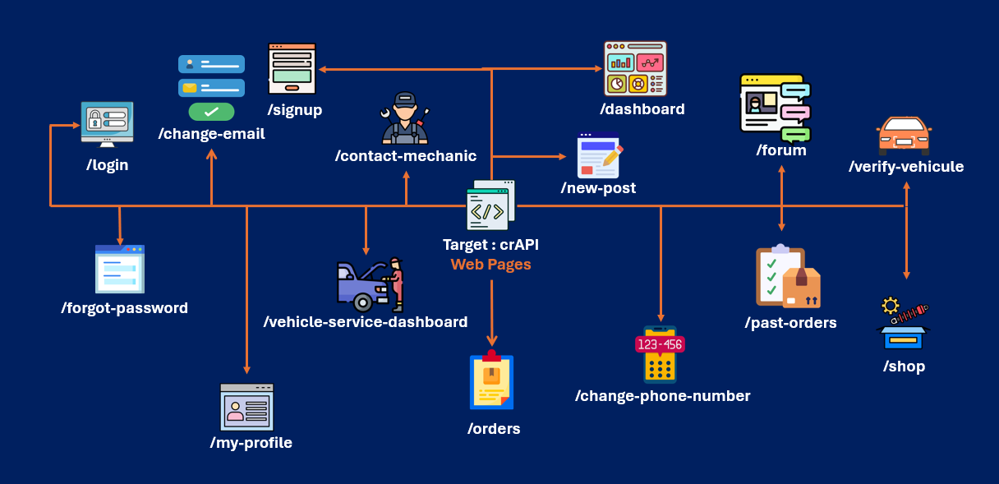
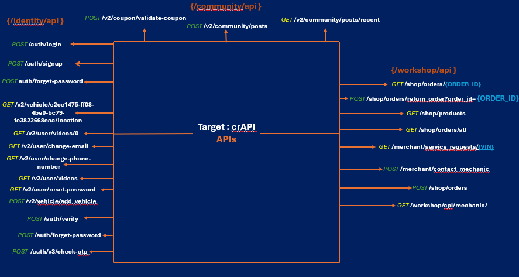

# Service Discovery and Technology Fingerprinting

## Tool
**nmap : v7.99**

## Scan Command
**nmap -sV -O -sC -sS 192.168.100.15**

## Scan Result
Host is up (0.0012s latency).
Not shown: 992 closed tcp ports (reset)
PORT     STATE SERVICE         VERSION
**8443/tcp open  ssl/http        OpenResty web app server 1.27.1.2**
|_http-server-header: openresty/1.27.1.2
| **tls-alpn:** 
|   http/1.1
|   http/1.0
|_  http/0.9
|_**http-title: crAPI**
|_ssl-date: TLS randomness does not represent time
**8888/tcp open  http            OpenResty web app server 1.27.1.2**
|_http-server-header: openresty/1.27.1.2
**|_http-title: crAPI**
Running: Microsoft Windows 11
OS CPE: cpe:/o:microsoft:windows_11

Nmap identified both HTTP (8888/tcp) and HTTPS (8443/tcp) services associated with the crAPI application. TLS support was confirmed on port 8443 through certificate enumeration and protocol negotiation. Further manual validation is required to confirm full application functionality through the HTTPS endpoint.

🔴 The OpenResty web app server disclosed its version through the HTTP Server Header which can be later used to search for vulnerabilities to exploit.

## Web Enumeration

### HTTP Service
**Accessing `http://localhost:8888`** routes the user directly to the login page.

### HTTPS Service
**Accessing `https://localhost:8443`** routes the user to the same login page.
- The browser displays a security warning indicating that the TLS certificate is not trusted.

### Observation
- The application exposes both HTTP and HTTPS versions of the login page.
- The HTTPS certificate appears to be self-signed, invalid, expired, or otherwise untrusted by the browser.
- Further investigation is required to determine the exact certificate issue.

### Potential Impact
- Users may receive browser security warnings before accessing the application.
- Security warnings can reduce user trust and may discourage some users from proceeding.
- In a production environment, an improperly configured TLS certificate could increase the risk of users ignoring important browser security warnings.

## crAPI Web Pages Map
- To create a map highlighting crAPI's web pages, we will use a combination of manual interaction with the application as a random user would:

## crAPI API endpoints Map
- As for the API, we will be using Burp Suite as our proxy and the same way, simulate actions a normal user would perform while Burp Suite intercepts CRUD http requests.
